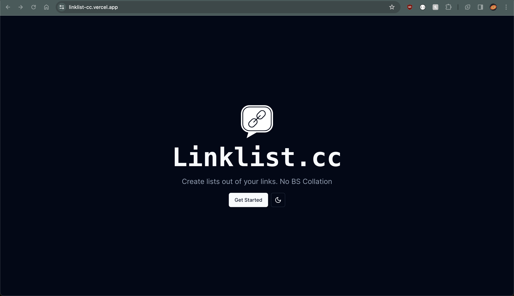

# LinkList

> a minimalist link collection & sharing tool.



## Overview

Our goal is to create a versatile & straightforward links collator. Possible target use cases include :

1. Usage in places where only one link can be used
2. Share related research consisting of videos, articles, websites & publications
3. Micro (or even nano) blogging. [ most of the blog in www are just lists that give Top N of X , n : number and x being a category ]
4. Share content in a clean way without fluff or ads.

## Getting Started

Here's how to get this project up and running in local environment.

### Prerequisites

- nvm - Node Version Manager
- Node.js (version 21.5.0)
- Yarn 4 (preferred)
- Modern Browsers like Chrome, FireFox

### Installation

Clone the repository and install dependencies.

```bash
git clone https://github.com/hckrs1/linklist.cc.git
cd linklist.cc

yarn
```

### Running the Project

Start the development server by running the `dev` command

```
yarn dev
```

Visit [http://localhost:3000/](http://localhost:3000)

## Built By

<div style="display: flex; justify-content: space-between; align-items: center;">
  
  <div style="width: 65%; height:80%; ">
    <p>hckrs1 Venture Studios <br/>
    www.hckrs.one<br/>Copyright &copy; 2024 | All Rights Reserved.</p>
  </div>
</div>
